# Screenshots

All screenshots live in [`../screenshots/`](../screenshots/). Grouped below by
where they were taken: the PWA on desktop, the native Android app, and the
same PWA on mobile.

## Desktop (PWA)

<table>
<tr>
<td align="center" valign="top">WiFi 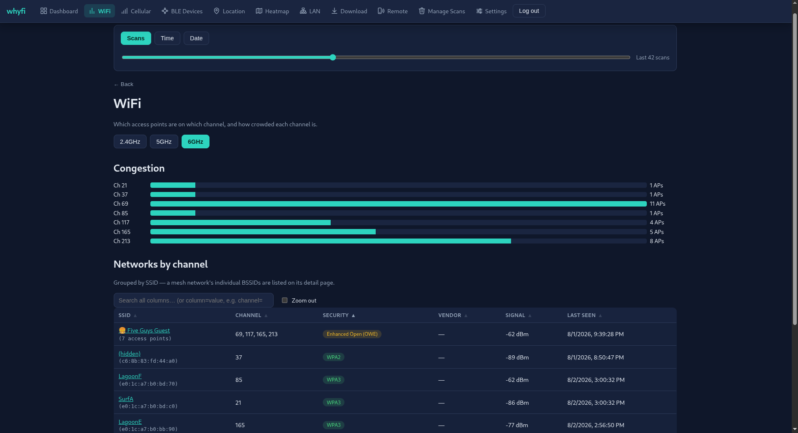</td>
<td align="center" valign="top">Heatmap 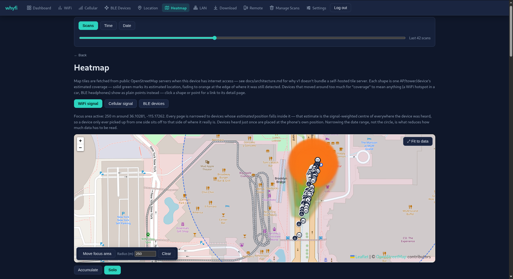</td>
</tr>
<tr>
<td align="center" valign="top">Download APK 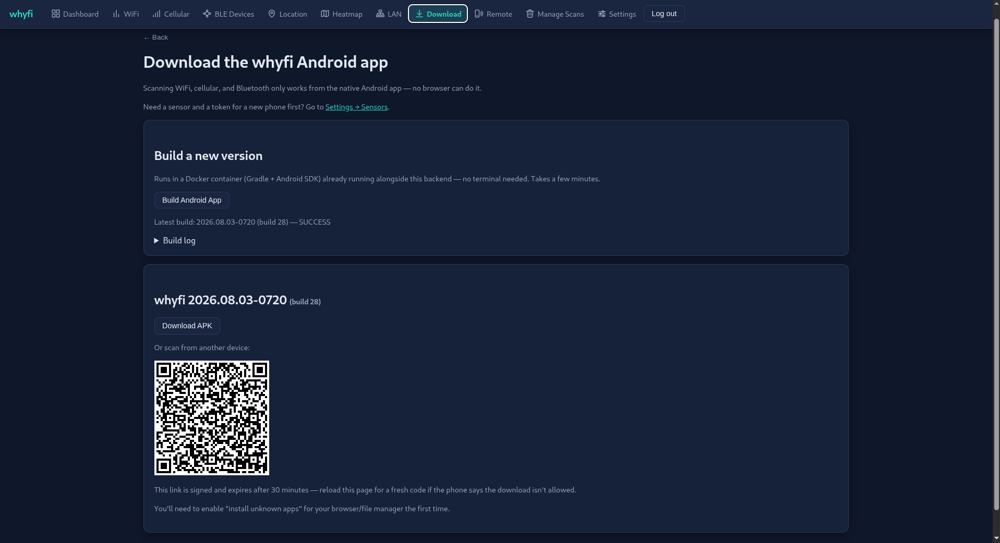</td>
<td align="center" valign="top">Remote devices 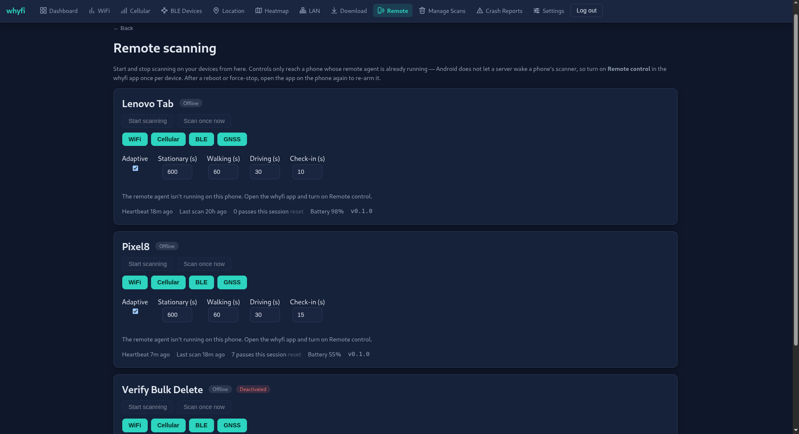</td>
</tr>
<tr>
<td align="center" valign="top">LAN scans 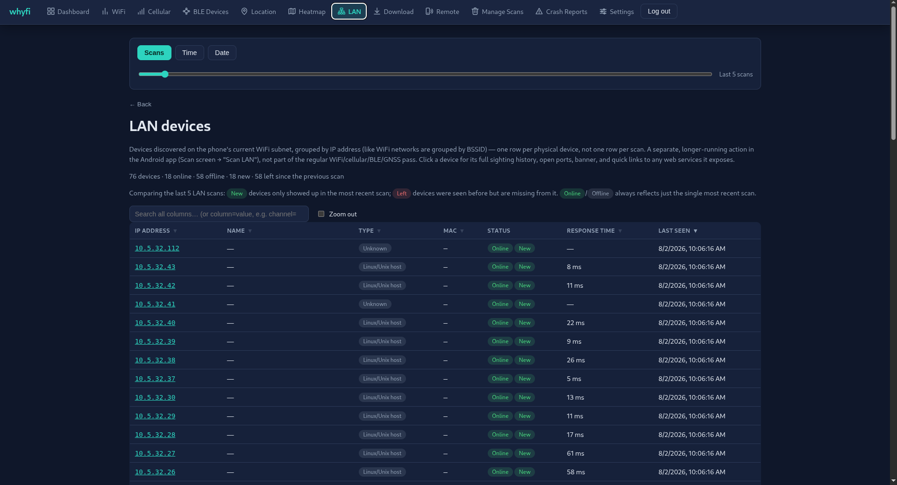</td>
<td align="center" valign="top">Settings 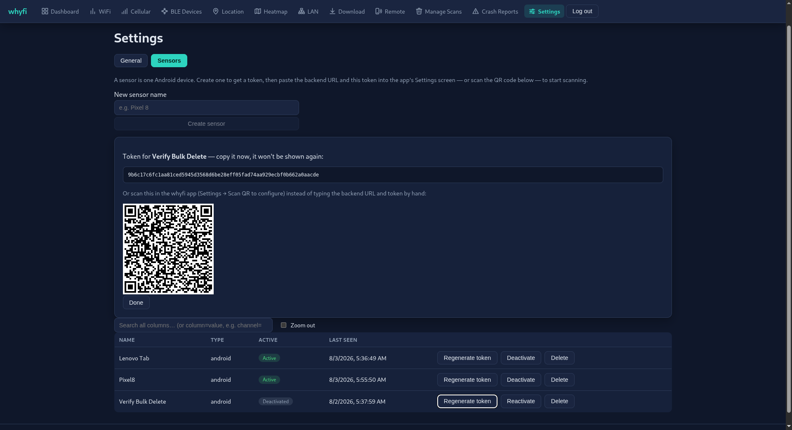</td>
</tr>
<tr>
<td align="center" valign="top">Printed report 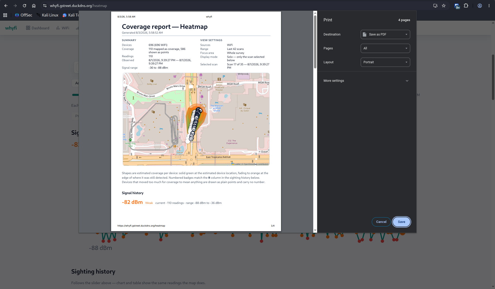</td>
<td align="center" valign="top">PDF report 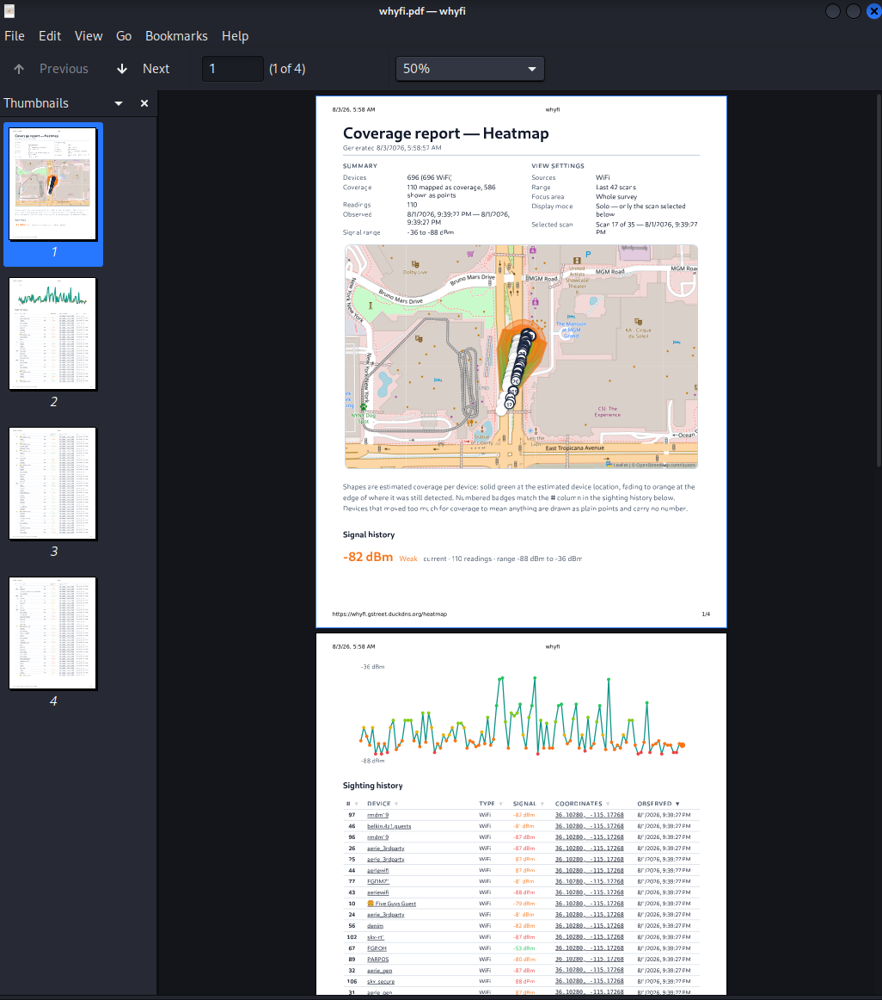</td>
</tr>
</table>

## App (native Android)

<table>
<tr>
<td align="center" valign="top">Dashboard 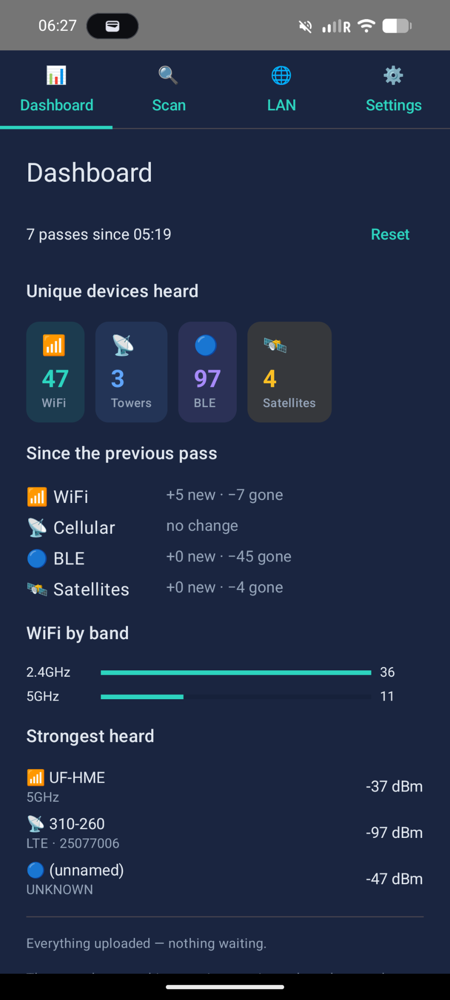</td>
<td align="center" valign="top">Scan 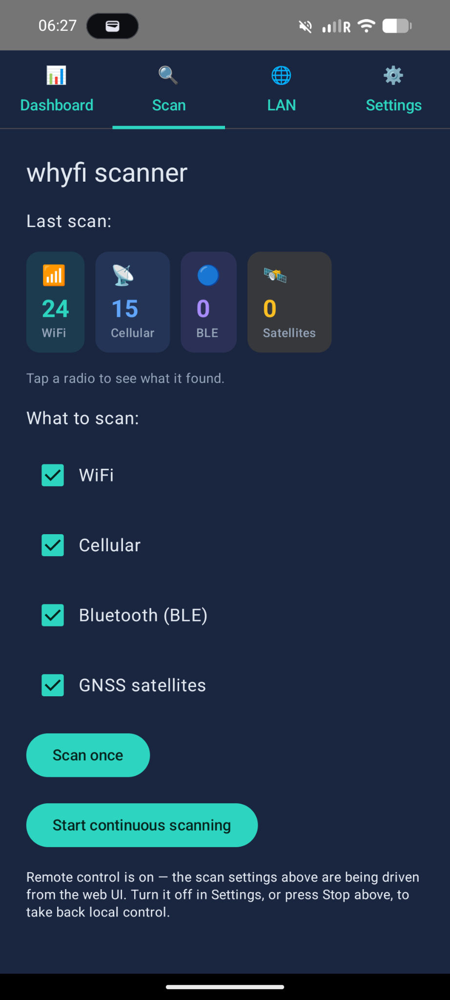</td>
</tr>
<tr>
<td align="center" valign="top">LAN 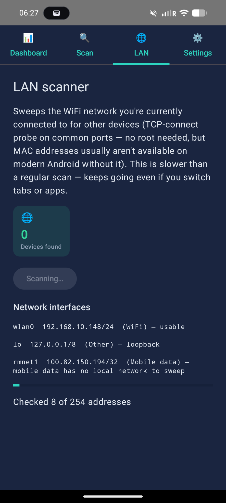</td>
<td align="center" valign="top">Settings 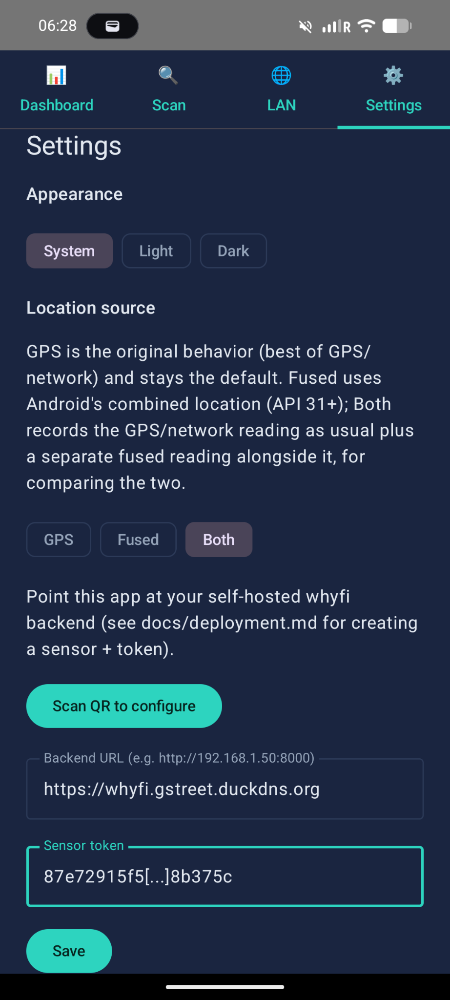</td>
</tr>
<tr>
<td align="center" valign="top">Settings 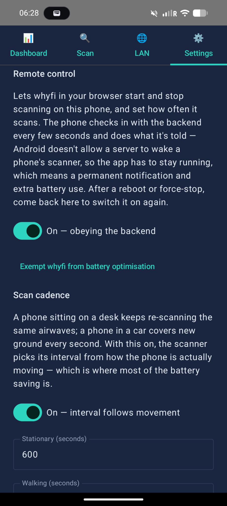</td>
<td align="center" valign="top">Settings 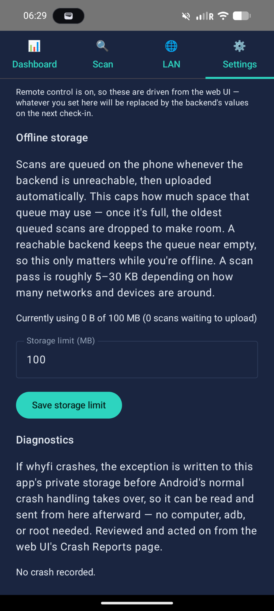</td>
</tr>
</table>

## Mobile (PWA)

<table>
<tr>
<td align="center" valign="top">Dashboard 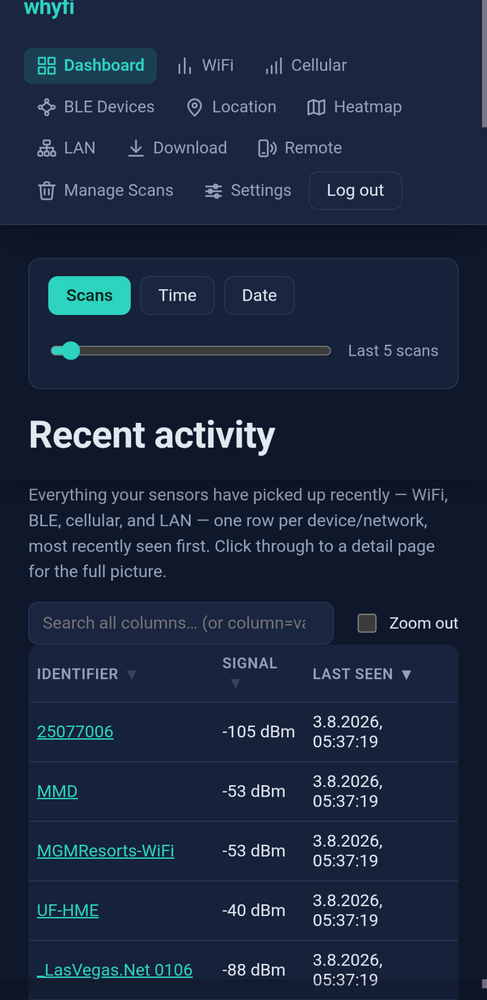</td>
<td align="center" valign="top">WiFi 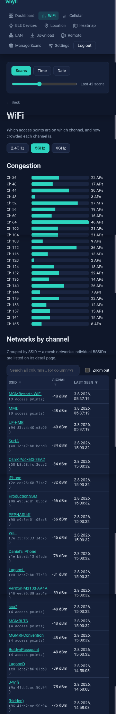</td>
</tr>
<tr>
<td align="center" valign="top">BLE 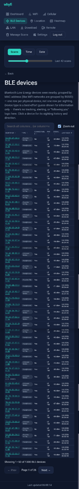</td>
<td align="center" valign="top">Cellular 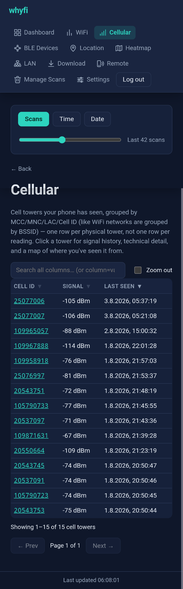</td>
</tr>
<tr>
<td align="center" valign="top">GPS 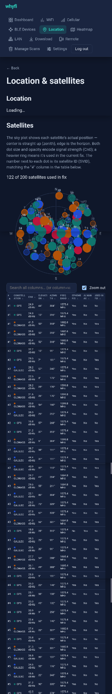</td>
<td align="center" valign="top">Heatmap 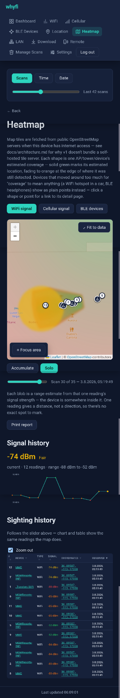</td>
</tr>
<tr>
<td align="center" valign="top">LAN scans 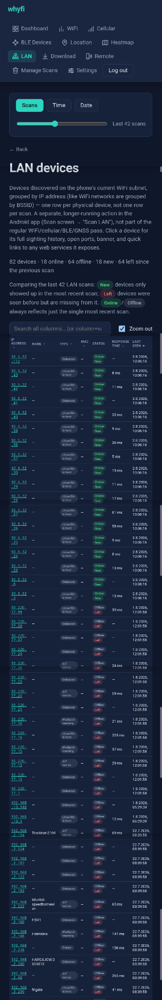</td>
<td align="center" valign="top">Remote 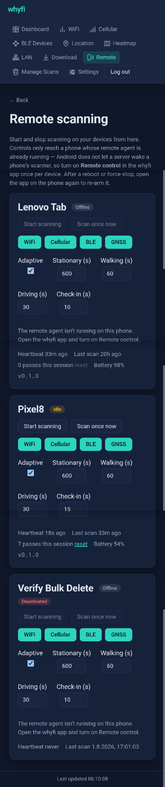</td>
</tr>
<tr>
<td align="center" valign="top">Settings 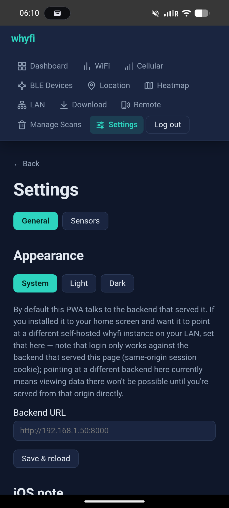</td>
<td align="center" valign="top">Settings 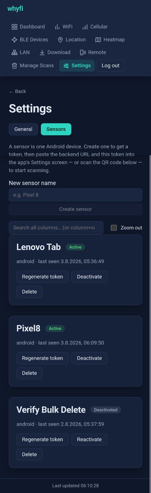</td>
</tr>
</table>
